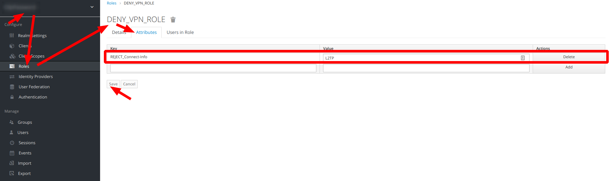

# Docker image with L2TP (IpSec, RadSec) server including routing and port forwarding

## Description
Access private network from the internet, support port forwarding from private network to outside via cloud.

[GitHub Project](https://github.com/vzakharchenko/l2tp-ipsec-radius-docker)

## Example


## Installation
[create /opt/config.json](#configjson-structure)
```
sudo apt-get update && sudo apt-get install -y curl
curl -sSL https://raw.githubusercontent.com/vzakharchenko/l2tp-ipsec-radius-docker/main/ubuntu.install| bash
```


## Features
 - Docker image
 - Keycloak authentication and authorization
 - Radius client
 - RadSec protocol (Radius over TLS)
 - IpSec
 - [Management routing  and portforwarding using json file](#configjson-structure)
 - [Connect to LAN from the internet](#connect-to-lan-from-the--internet)
 - [Port forwarding](#port-forwarding)
 - [Connect multiple networks](#connect-multiple-networks)
 - [Automatic installation(Ubuntu)](#automatic-cloud-installation)
 - [Manual Installation steps (Ubuntu)](#manual-cloud-installationubuntu)

## config.json structure

```json
{
   "radsec":{
      "privateKey": RADSEC_PRIVATE_KEY,
      "certificateFile": RADSEC_CERTIFICATE_FILE,
      "CACertificateFile": RADSEC_CA_CERTIFICATE_FILE,
      "certificateKeyPassword": RADSEC_PRIVATE_KEY_PASSWORD
   },
   "keycloak":{
      "json":KEYCLOAK_JSON
   },
   "radius":{
      "protocol":RADIUS_PROTOCOL
   },
   "authorizationMap":{
      "roles":{
         KEYCLOAK_ROLE:{
            "routes":ROUTING_TABLE,
            "forwarding":{
               "sourceIp":APPLICATION_IP,
               "sourcePort":APPLICATION_PORT,
               "externalPort":REMOTE_PORT
            }
         }
      }
   },
   "ipsec":{
      "secret":IPSEC_SHARED_SECRET
   }
}
```
Where
- **RADSEC_PRIVATE_KEY** ssl privateKey
- **RADSEC_CERTIFICATE_FILE** ssl private certificate
- **CACertificateFile** ssl CA certificate
- **certificateKeyPassword** privateKey password
- **KEYCLOAK_JSON** [Keycloak.json](#configure-keycloak)
- **RADIUS_PROTOCOL** Radius protocol. Supported pap,chap and mschap-v2. If used RadSec(Radius over TLS) then better to use PAP, otherwise mschap-v2
- **APPLICATION_IP** service IP behind NAT (port forwarding)
- **APPLICATION_PORT** service PORT behind NAT (port forwarding)
- **REMOTE_PORT**  port accessible from the internet (port forwarding)
- **ROUTING_TABLE**  ip with subnet for example 192.168.8.0/24
- **KEYCLOAK_ROLE**  Role assigned to user
- **IPSEC_SHARED_SECRET**  Ipsec shared secret

## Installation [Keycloak-Radius-plugin](https://github.com/vzakharchenko/keycloak-radius-plugin)
- [Release Setup](https://github.com/vzakharchenko/keycloak-radius-plugin#release-setup)
- [Docker Setup](https://github.com/vzakharchenko/keycloak-radius-plugin/blob/master/docker/README.md)
- [Manual Setup](https://github.com/vzakharchenko/keycloak-radius-plugin#manual-setup)

## Configure Keycloak
1. Create Realm with Radius client


2. Create OIDC client to Radius Realm

3. Enable Service Accounts for OIDC client

4. Add role "Radius Session Role" to Service Accounts

5. Download Keycloak.json

6. add keycloak.json to config.json
```json
{
  "radsec": {
    "privateKey": RADSEC_PRIVATE_KEY,
    "certificateFile": RADSEC_CERTIFICATE_FILE,
    "CACertificateFile": RADSEC_CA_CERTIFICATE_FILE,
    "certificateKeyPassword": RADSEC_PRIVATE_KEY_PASSWORD
  },
  "keycloak": {
    "json": {
        "realm": "VPN",
        "auth-server-url": "http://192.168.1.234:8090/auth/",
        "ssl-required": "external",
        "resource": "vpn-client",
        "credentials": {
            "secret": "12747feb-794b-4561-a54f-1f49e9366b21"
         },
        "confidential-port": 0
    }
  },
  "radius": {
    "protocol":"pap"
  },
  "ipsec":{
     "secret":"123456"
  }
}
```
7. create private key, certificate  and CA certificate : RADSEC_PRIVATE_KEY ,  RADSEC_CERTIFICATE_FILE, 


## Examples

### Connect to LAN from the  internet

**user1** - router with subnet 192.168.88.0/24 behind NAT     
**user2** - user who has access to subnet 192.168.88.0/24 from the Internet   
```json
{
   "radsec":{
      "privateKey":"RADSEC_PRIVATE_KEY",
      "certificateFile":"RADSEC_CERTIFICATE_FILE",
      "CACertificateFile":"RADSEC_CA_CERTIFICATE_FILE",
      "certificateKeyPassword":"RADSEC_PRIVATE_KEY_PASSWORD"
   },
   "keycloak":{
      "json":{
         "realm":"VPN",
         "auth-server-url":"http://192.168.1.234:8090/auth/",
         "ssl-required":"external",
         "resource":"vpn-client",
         "credentials":{
            "secret":"12747feb-794b-4561-a54f-1f49e9366b21"
         },
         "confidential-port":0
      }
   },
   "radius":{
      "protocol":"pap"
   },
   "authorizationMap":{
      "roles":{
         "Role1":{
            "routing":[
               {
                  "route":"192.168.88.0/24"
               }
            ]
         }
      }
   },
   "ipsec":{
      "secret":"123456"
   }
}
```


### Port forwarding

**user** - router with subnet 192.168.88.0/24 behind NAT.     
Subnet contains service http://192.168.8.254:80 which is available at from http://195.138.164.211:9000

```json
{
   "radsec":{
      "privateKey":"RADSEC_PRIVATE_KEY",
      "certificateFile":"RADSEC_CERTIFICATE_FILE",
      "CACertificateFile":"RADSEC_CA_CERTIFICATE_FILE",
      "certificateKeyPassword":"RADSEC_PRIVATE_KEY_PASSWORD"
   },
   "keycloak":{
      "json":{
         "realm":"VPN",
         "auth-server-url":"http://192.168.1.234:8090/auth/",
         "ssl-required":"external",
         "resource":"vpn-client",
         "credentials":{
            "secret":"12747feb-794b-4561-a54f-1f49e9366b21"
         },
         "confidential-port":0
      }
   },
   "radius":{
      "protocol":"pap"
   },
   "authorizationMap":{
      "roles":{
         "Role1":{
            "forwarding":[
               {
                  "sourceIp":"192.168.88.1",
                  "sourcePort":"80",
                  "destinationPort":9000
               }
            ]
         }
      }
   },
   "ipsec":{
      "secret":"123456"
   }
}
```
### connect multiple networks

**user1** - router with subnet 192.168.88.0/24 behind NAT. Subnet contains service http://192.168.88.254:80 which is available at from http://195.138.164.211:9000     
**user2** - router with subnet 192.168.89.0/24 behind NAT.       
**user3** - user who has access to subnets 192.168.88.0/24 and 192.168.89.0/24 from the Internet    
```json
{
   "radsec":{
      "privateKey":"RADSEC_PRIVATE_KEY",
      "certificateFile":"RADSEC_CERTIFICATE_FILE",
      "CACertificateFile":"RADSEC_CA_CERTIFICATE_FILE",
      "certificateKeyPassword":"RADSEC_PRIVATE_KEY_PASSWORD"
   },
   "keycloak":{
      "json":{
         "realm":"VPN",
         "auth-server-url":"http://192.168.1.234:8090/auth/",
         "ssl-required":"external",
         "resource":"vpn-client",
         "credentials":{
            "secret":"12747feb-794b-4561-a54f-1f49e9366b21"
         },
         "confidential-port":0
      }
   },
   "radius":{
      "protocol":"pap"
   },
   "authorizationMap":{
      "roles":{
         "Role1":{
            "forwarding":[
               {
                  "sourceIp":"192.168.88.254",
                  "sourcePort":"80",
                  "destinationPort":9000
               }
            ],
            "routing":[
               {
                  "route":"192.168.88.0/24"
               }
            ]
         },
         "Role2":{
            "routing":[
               {
                  "route":"192.168.89.0/24"
               }
            ]
         }
      }
   },
   "ipsec":{
      "secret":"123456"
   }
}
```


## Troubleshooting
1. Viewing logs in docker container:
```
docker logs l2tp-ipsec-radius-docker -f
```
2. print routing tables
```
docker exec l2tp-ipsec-radius-docker bash -c "ip route"
```
3. print iptable rules
```
docker exec l2tp-ipsec-radius-docker bash -c "iptables -S"
```


## Cloud Installation
### Automatic cloud installation
[create /opt/config.json](#configjson-structure)
```
sudo apt-get update && sudo apt-get install -y curl
curl -sSL https://raw.githubusercontent.com/vzakharchenko/l2tp-ipsec-radius-docker/main/ubuntu.install -o ubuntu.install
chmod +x ubuntu.install
./ubuntu.install
```

### Deny access user to use VPN

- create client/realm role and add attribute:
```
REJECT_Connect-Info=L2TP
```


- assign a role to a user and after that the user will always be rejected

### Manual Cloud Installation(Ubuntu)

1. install all dependencies
```
sudo apt-get update && sudo apt-get install -y iptables git iptables-persistent nodejs linux-modules-extra-$(uname -r)
```
2. install docker
```
sudo apt-get remove docker docker.io containerd runc
sudo curl -sSL https://get.docker.com | bash
sudo groupadd docker
sudo usermod -aG docker $USER
newgrp docker
```

3. Configure host machine
```
sysctl -w net.ipv4.ip_forward=1
sysctl -w net.netfilter.nf_conntrack_helper=1
sudo echo "net.ipv4.ip_forward=1">/etc/sysctl.conf
sudo echo "net.netfilter.nf_conntrack_helper=1">/etc/sysctl.conf
```
4. [create /opt/config.json](#configjson-structure)

5. start docker image

```
export CONFIG_PATH=/opt/config.json
curl -sSL https://raw.githubusercontent.com/vzakharchenko/docker-l2tp-port-forwarding/main/l2tp-js/generateDockerCommands.js -o generateDockerCommands.js
`node generateDockerCommands.js`
```
